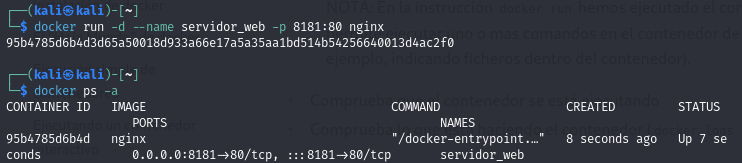
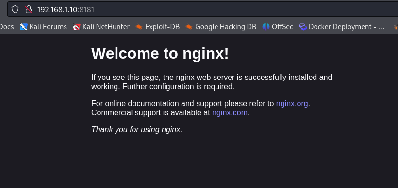
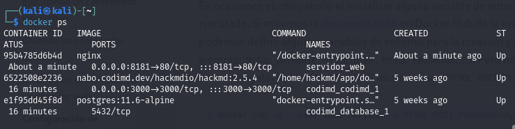
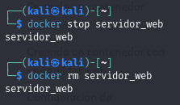

# PPS-Unidad0EjerciciosDocker-Alvaro

Vamos a hacer una serie de ejercicios con **Docker**:

## Indice
[Ejercicio de introducción](#Ejercicio-de-introducción)

Ejercicio de imagenes

Ejercicio de almacenamiento

Ejercicio de Redes


----

### Ejercicio de introducción

Crearemos un ***contenedor demonio*** a partir de la imagen nginx, el contenedor se debe llamar ```servidor_web``` y se debe acceder a él utilizando el puerto ```8181``` del ordenador donde tengas instalado docker.

Para instalar el contenerdor ponemos lo siguiente: ```docker run -d --name servidor_web -p 8181:80 nginx```

```-d``` es para que se ejecute en segundo plano, ```--name servidor_web``` para darle ese nombre al contenedor, ```-p 8181:80``` para indicarle que se ejecute en el puerto 8181 y por último le indicamos ```nginx``` que es la imagen que queremos.

Luego vemos las imagenes activas con ```docker ps -a```.



Ahora comprobamos en el navegador que se esta ejecutando el contenedor de nginx:




Ahora vemos las imagenes que tenemos en nuestro registro local:



Por último paramos el contenedor y lo eliminamos:


