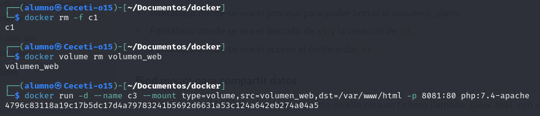

# Ejercicio de almacenamiento - Docker


----

1. Creamos los siguientes volúmenes: '**volumen_datos**' y '**volumen_web**':


2. Una vez creados estos contenedores arrancamos un contenedor llamado '**c1**' sobre la imagen '**php:7.4-apache**' que monte el '**volumen_web**' en la ruta '**/var/www/html**' y que sea accesible en el puerto '**8080**', y otro contenedor llamado '**c2**' sobre la imagen '**mariadb**' que monte el '**volumen_datos**' en la ruta '**/var/lib/mysql**' y cuya contraseña de ```root``` sea ```admin```:


3. Borramos el volumen '**volumen_datos**', parando y borrando el contenedor '**c2**' previamente:


4. Copiamos un fichero index.html al contenedor c1, accedemos al contenedor y comprobamos que se está visualizando:


5. Borramos el contenedor '**c1**' y creamos un contenedor '**c3**' con las mismas características que '**c1**' pero sirviendo en el puerto '**8081**':



6. Accedemos al contenedor '**c3**' desde el navegador:

