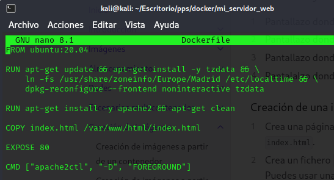
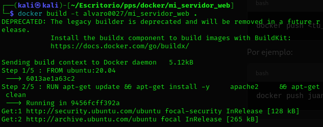
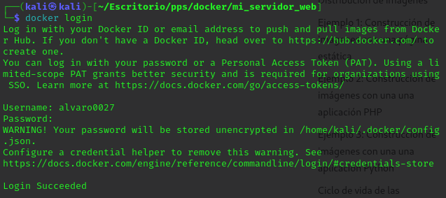
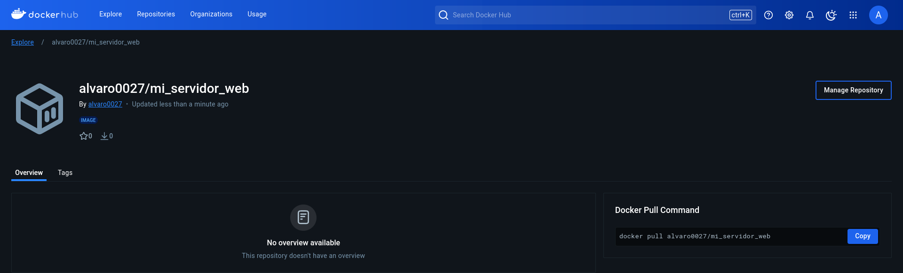
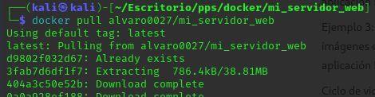
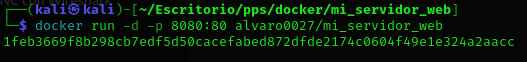
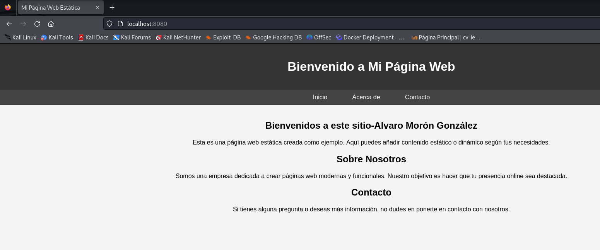

# Ejercicio de creación de imagenes - Docker

----

En este ejercicio vamos a crear una imagen a partir de un **Dockerfile**.

1. Lo primero es crear un directorio con el nombre de '**mi_servidor_web**', dentro de el creamos un archivo ```index.html``` con una plantilla de HTML5, también creamos un fichero **Dockerfile** con la siguiente configuración:



2. Creamos la nueva imagen con nuestro nombre de usuario que tenemos en la cuenta de **Docker Hub**:



3. Ahora nos conectamos a **Docker Hub**:



4. Y ahora subimos la imagen que acabamos de crear y comprobamos en **Docker Hub** que esta nuestra imagen:



5. Ahora eliminamos la imagen con ```docker rmi``` y nos la descargamos de **Docker Hub**:



6. Creamos un contenedor a partir de la imagen recien descargada:



7. Y por último la visualizamos desde el navegador:

