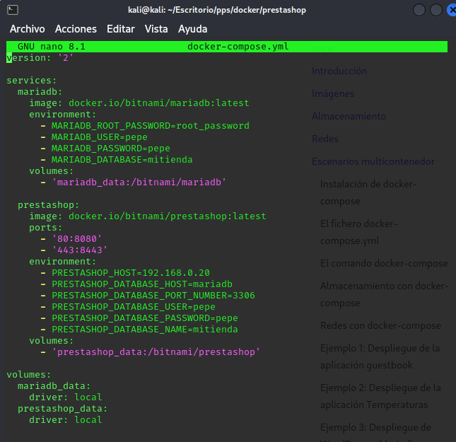
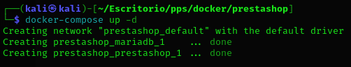
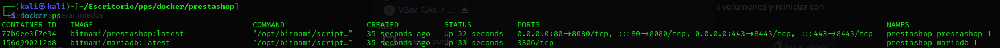
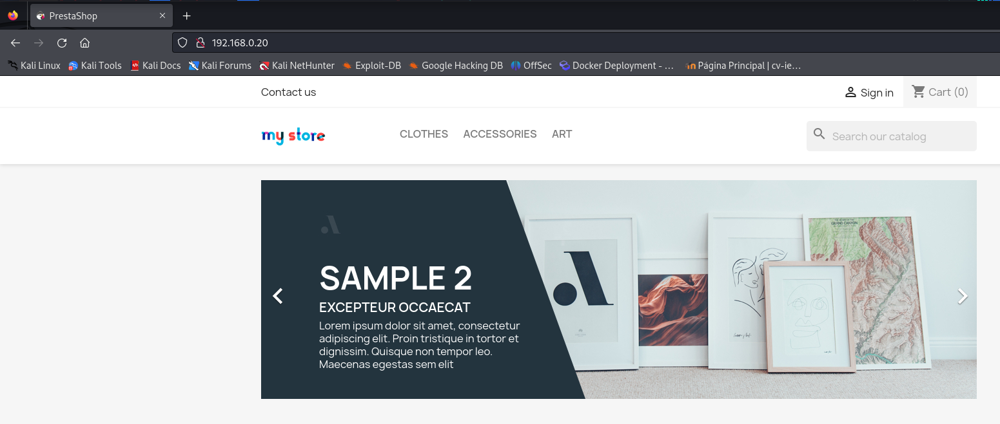

# Ejercicio de escenarios multicontenedor - Docker

----

Vamos a desplegar una tienda virtual construída con **prestashop**

1. Creamos un directorio con el nombre de prestashop, y dentro cremos un fichero docker-compose.yml con la siguiente configuración:



2. Levantamos los servicio de **prestashop** y **mariadb** con ```docker-compose up -d```:



3. Y comprobamos que estan funcionando:



4. Por último accedemos desde el navegador a la aplicación:

