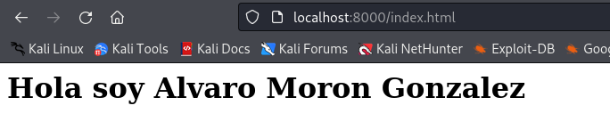
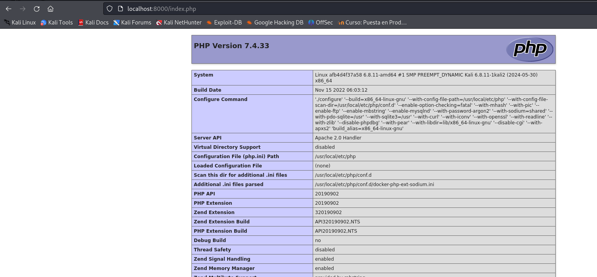
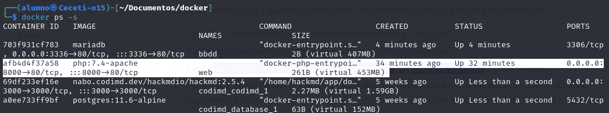
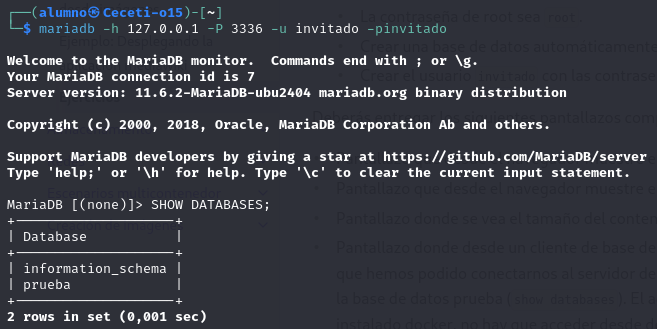
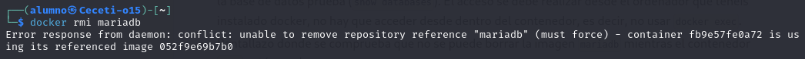

# Ejercicio de imagenes - Docker

----


1. Arrancamos un **contenedor** que ejecute una instancia de la imagen '***php:7.4-apache***', que se llame '***web***' y que sea accesible desde tu equipo en el puerto '***8000***'.
2. Colocamos en el directorio raíz del servicio web (/var/www/html) de dicho contenedor un fichero llamado '***index.html***' con el siguiente contenido: ```<h1>HOLA SOY Alvaro Moron Gonzalez</h1>```
3. Ahora colocamos en ese mismo directorio raíz un archivo llamado index.php con el siguiente contenido: ```<?php echo phpinfo(); ?>```
4. Visualizamos el contenido de '**index.html**' y '**index.php**' desde el navegador:
 




5. Tamaño del contenedor web después de crear los dos ficheros: 



6. Arrancamos un contenedor que se llame '**bbdd**' y que ejecute una instancia de la imagen '**mariadb**' para que sea accesible desde el puerto **3336** y establecemos las variables de entorno necesarias para que:
*     La contraseña de root sea root.
*     Crear una base de datos automáticamente al arrancar que se llame prueba.
*     Crear el usuario invitado con las contraseña invitado.
 
8. Comprobamos que hemos podido conectarnos al servidor de base de datos con el usuario creado y que se ha creado la base de datos '**prueba**':



9. Intentamos borrar la imagen mariadb mientras el contenedor bbdd está creado:


No deja eliminar la imagen mientras el contenedor '**bbdd**' esta creado.


