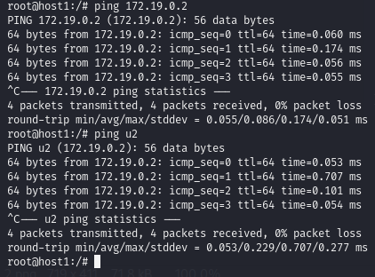

# Ejercicio de redes - Docker

----

1. Vamos a crear dos redes de tipo **BRIDGE** con los siguientes datos:

Red1

    Nombre: red1
    Dirección de red: 172.28.0.0
    Máscara de red: 255.255.0.0
    Gateway: 172.28.0.1

Red2

    Nombre: red2
    Es resto de los datos será proporcionados automáticamente por Docker.

2. Ponemos en ejecución un contenedor de la imagen '**ubuntu:20.04**' que tenga como hostname '**host1**', como IP '**172.28.0.10**' y que esté conectado a la '**red1**'. Lo llamaremos '**u1**'.

3. Ponemos en ejecución otro contenedor de la imagen '**ubuntu:20.04**' que tenga como hostname '**host2**' y que esté conectado a la '**red2**'. En este caso será docker el que le de una IP correspondiente a esa red. Lo llamaremos '**u2**'.

4. Una vez creados los contenedores 'u1' y 'u2', visualizamos la configuración de red de ambos contenedores:


5. Desde cualquiera de los dos contenedores no podemos hacer ping al otro ni por ip ni por nombre:


6. Ahora si conectamos el contenedor '**u1**' a la '**red2**', desde el contenedor '**u1**', tenemos acceso al contenedor '**u2**' mediante ```ping```, tanto por nombre como por ip:

